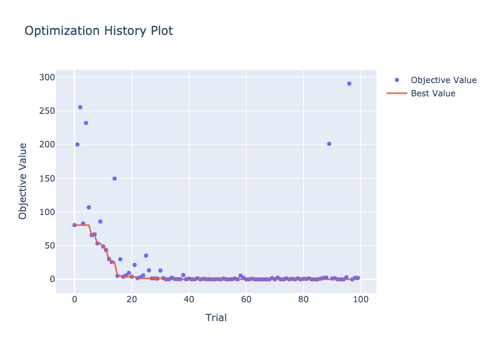

## Class or Function Names

- HEBOSampler

## Installation

```bash
pip install -r requirements.txt
git clone git@github.com:huawei-noah/HEBO.git
cd HEBO/HEBO
pip install -e .
```

## Example

```python
search_space = {
    "x": FloatDistribution(-10, 10),
    "y": IntDistribution(0, 10),

}
sampler = HEBOSampler(search_space)
study = optuna.create_study(sampler=sampler)
```

See [`example.py`](https://github.com/optuna/optunahub-registry/blob/main/package/samplers/hebo/example.py) for a full example.


## Others

HEBO is the winning submission to the [NeurIPS 2020 Black-Box Optimisation Challenge](https://bbochallenge.com/leaderboard).
Please refer to [the official repository of HEBO](https://github.com/huawei-noah/HEBO/tree/master/HEBO) for more details.

### Reference

Cowen-Rivers, Alexander I., et al. "An Empirical Study of Assumptions in Bayesian Optimisation." arXiv preprint arXiv:2012.03826 (2021).
