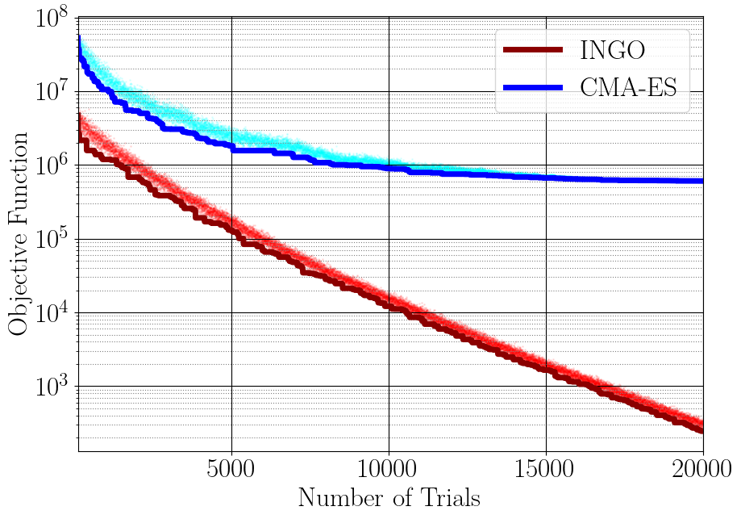

## Class or Function Names

- ImplicitNaturalGradientSampler

## Example

```python
import optuna
import optunahub


def objective(trial: optuna.Trial) -> float:
    x = trial.suggest_float("x", -100, 100)
    y = trial.suggest_float("y", -100, 100)
    return x**2 + y**2


def main() -> None:
    mod = optunahub.load_module("samplers/implicit_natural_gradient")

    sampler = mod.ImplicitNaturalGradientSampler()
    study = optuna.create_study(sampler=sampler)
    study.optimize(objective, n_trials=200)

    print(study.best_trial.value, study.best_trial.params)


if __name__ == "__main__":
    main()
```

## Others

📝 [**A Natural Gradient-Based Optimization Algorithm Registered on OptunaHub**](https://medium.com/optuna/a-natural-gradient-based-optimization-algorithm-registered-on-optunahub-0dbe17cb0f7d): Blog post by Hiroki Takizawa. In the post, benchmark results are presented as shown in the figure below.



### Reference

Yueming Lyu, Ivor W. Tsang (2019). Black-box Optimizer with Implicit Natural Gradient. arXiv:1910.04301
