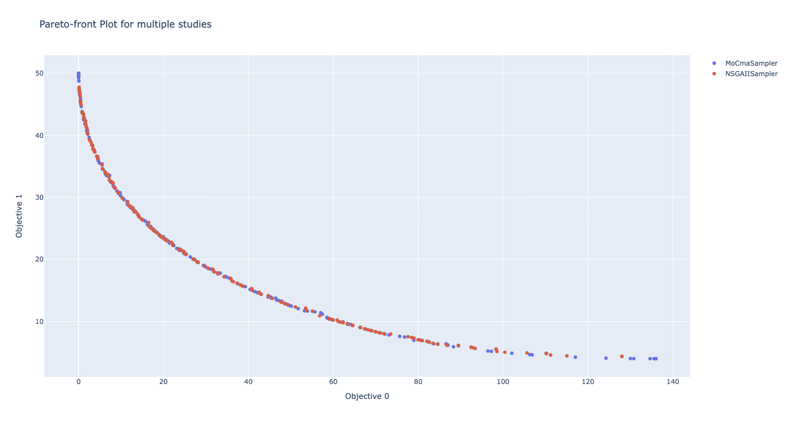

## Abstract

MoCmaSampler provides the implementation of the s-MO-CMA-ES algorithm. This algorithm extends (1+1)-CMA-ES to multi-objective optimization by introducing a selection strategy based on non-domination sorting and contributing hypervolume (S-metric). It inherits important properties of CMA-ES, invariance against order-preserving transformations of the fitness function value and rotation and translation of the search space.

## Class or Function Names

- `MoCmaSampler(*, search_space: dict[str, BaseDistribution] | None = None, popsize: int | None = None, seed: int | None = None)`
  - `search_space`: A dictionary containing the search space that defines the parameter space. The keys are the parameter names and the values are [the parameter's distribution](https://optuna.readthedocs.io/en/stable/reference/distributions.html). If the search space is not provided, the sampler will infer the search space dynamically.
    Example:
    ```python
    search_space = {
        "x": optuna.distributions.FloatDistribution(-5, 5),
        "y": optuna.distributions.FloatDistribution(-5, 5),
    }
    MoCmaSampler(search_space=search_space)
    ```
  - `popsize`: Population size of the CMA-ES algorithm. If not provided, the population size will be set based on the search space dimensionality. If you have a sufficient evaluation budget, it is recommended to increase the popsize.
  - `seed`: Seed for random number generator.

Note that because of the limitation of the algorithm, only non-conditional numerical parameters are sampled by the MO-CMA-ES algorithm, and categorical parameters and conditional parameters are handled by random sampling.

## Example

```python
import optuna
import optunahub


def objective(trial: optuna.Trial) -> tuple[float, float]:
    x = trial.suggest_float("x", 0, 5)
    y = trial.suggest_float("y", 0, 3)
    v0 = 4 * x**2 + 4 * y**2
    v1 = (x - 5) ** 2 + (y - 5) ** 2
    return v0, v1

samplers = [
    optunahub.load_module("samplers/mocma").MoCmaSampler(popsize=100, seed=42),
    optuna.samplers.NSGAIISampler(population_size=100, seed=42),
]
studies = []
for sampler in samplers:
    study = optuna.create_study(
        directions=["minimize", "minimize"],
        sampler=sampler,
        study_name=f"{sampler.__class__.__name__}",
    )
    study.optimize(objective, n_trials=1000)
    studies.append(study)

optunahub.load_module("visualization/plot_pareto_front_multi").plot_pareto_front(
    studies
).show()
optunahub.load_module("visualization/plot_hypervolume_history_multi").plot_hypervolume_history(
    studies, reference_point=[200.0, 100.0]
).show()
```




## Others

### Test

To execute the tests for MoCmaSamler, please run the following commands. The test file is provided in the package.

```sh
pip install pytest
```

```python
pytest -s tests/test_sampler.py
```

### Reference

Christian Igel, Nikolaus Hansen, Stefan Roth. Covariance Matrix Adaptation for Multi-objective Optimization, Evolutionary Computatio. (2007) 15 (1): 1–28. https://doi.org/10.1162/evco.2007.15.1.1.

### BibTeX

```bibtex
@article{igel2007covariance,
  title={Covariance matrix adaptation for multi-objective optimization},
  author={Igel, Christian and Hansen, Nikolaus and Roth, Stefan},
  journal={Evolutionary computation},
  volume={15},
  number={1},
  pages={1--28},
  year={2007},
  publisher={MIT Press One Rogers Street, Cambridge, MA 02142-1209, USA journals-info~…}
}
```
