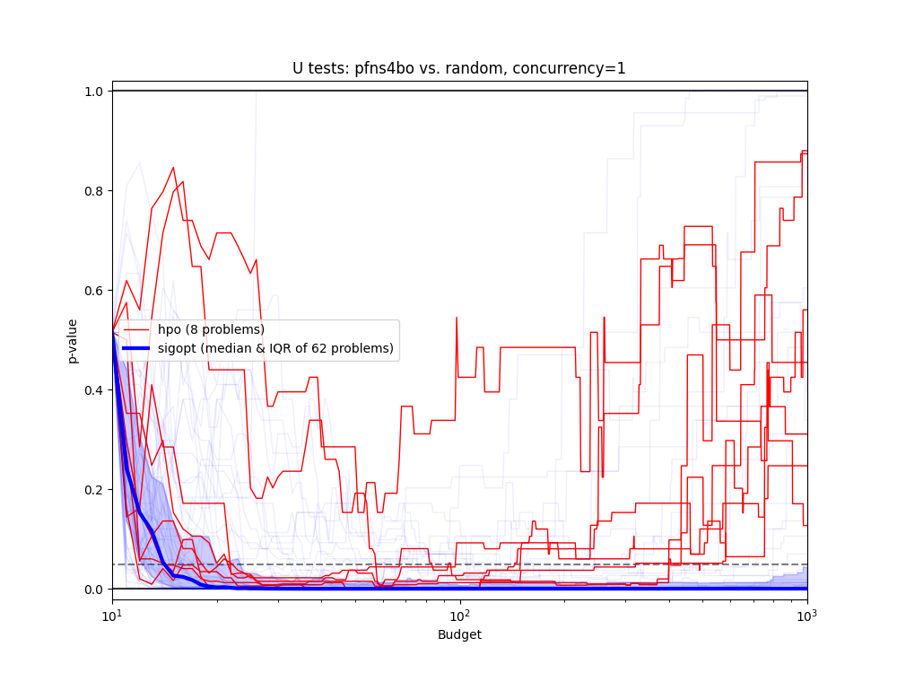

## Class or Function Names
- PFNs4BOSampler

## Installation
```bash
pip install -r requirements.txt
```

## Example
```python
from __future__ import annotations

import os

import optuna
import optunahub


module = optunahub.load_module("samplers/pfns4bo")
PFNs4BOSampler = module.PFNs4BOSampler


def objective(trial: optuna.Trial) -> float:
    x = trial.suggest_float("x", -10, 10)
    return (x - 2) ** 2


if __name__ == "__main__":
    study = optuna.create_study(
        sampler=PFNs4BOSampler(),
    )
    study.optimize(objective, n_trials=100)
    print(study.best_params)
    print(study.best_value)
```
See [`example.py`](https://github.com/optuna/optunahub-registry/blob/main/package/samplers/pfns4bo/example.py) for a full example. You need GPU to run this example.

The following figures are experimental results of the comparison between PFNs4BO and the random search.
This figure stands for the performance of PFNs4BO against the random search. The horizontal axis represents the amount of budgets, which is equal to the number of trials. The vertical axis represents the p-value of the Mann–Whitney U test, in which the null hypothesis is that the PFNs4BO loses the random search. Therefore, don't get me wrong, but the lower is better.
The benchmark consists of 70 problems. The 8 problems are from HPO tabular benchmarks in https://github.com/automl/HPOBench (original 4 problems, and log-converted 4 problems). The 62 problems are several synthetic functions in https://github.com/sigopt/evalset (Not just use it, but I re-implement them).


## Others

### Reference

Samuel Müller, Matthias Feurer, Noah Hollmann, and Frank Hutter. 2023. PFNs4BO: in-context learning for Bayesian optimization. In Proceedings of the 40th International Conference on Machine Learning (ICML'23), Vol. 202. JMLR.org, Article 1056, 25444–25470.
